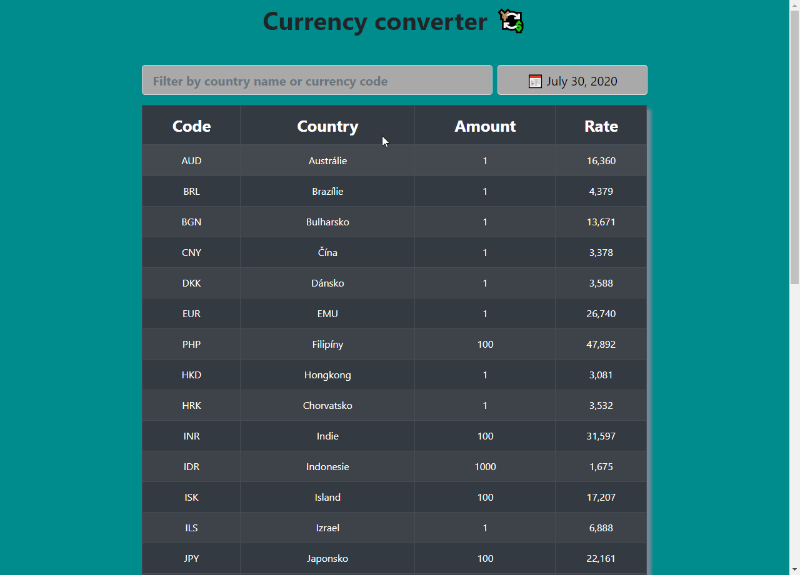

# Currency Converter

## Description
Web app that fetches data from (Czech National Bank website)[www.cnb.cz/en] and displays exchange rates for current(selected) day. After data being fetched the user is allowed to filter results by country or currency code.

## Demo

## Live demo
Project's live demo is hosted on [www.currency-converter.techis.fun](http://currency-converter.techis.fun/) with [vercel](https://vercel.com).

## Technology used
- [ReactJS 16.8](https://reactjs.org/)
- [React bootstrap](https://react-bootstrap.github.io/)
- [React Date Picker](https://www.npmjs.com/package/react-datepicker)

## Data Source
[www.cnb.cz](https://www.cnb.cz/cs/financni-trhy/devizovy-trh/kurzy-devizoveho-trhu/kurzy-devizoveho-trhu/)

## Licence
MIT