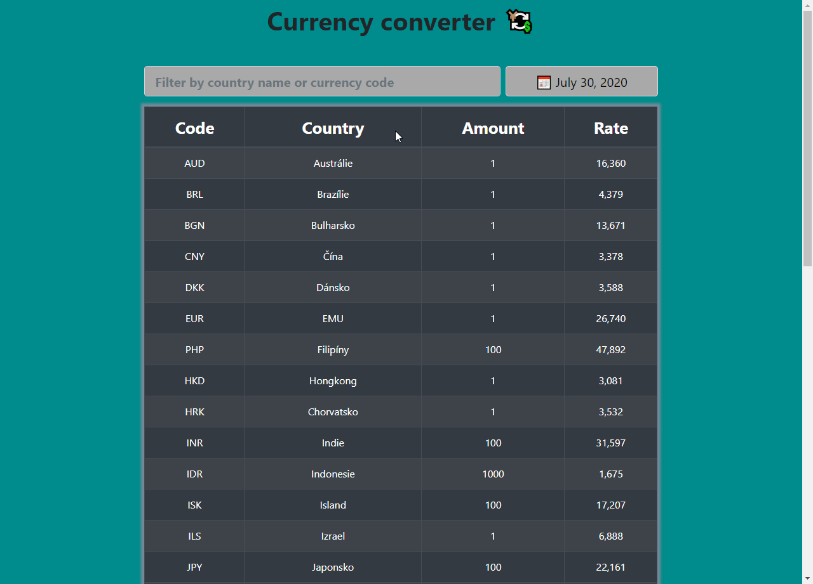

# Currency Converter

## Description
Web app fetches data from [Czech National Bank website](www.cnb.cz/en) display exchange rates for current day and allow user to filet results by country or currency code.

## Demo

## Live demo
Project's live demo is hosted on [www.currency.techis.fun](http://currency.techis.fun/) with [netlify](https://www.netlify.com/).

## Technology used
- [ReactJS 16.8](https://reactjs.org/)
- [React bootstrap](https://react-bootstrap.github.io/)
- [React Date Picker](https://www.npmjs.com/package/react-datepicker)

## Data Source
[www.cnb.cz](https://www.cnb.cz/cs/financni-trhy/devizovy-trh/kurzy-devizoveho-trhu/kurzy-devizoveho-trhu/)

## Licence
